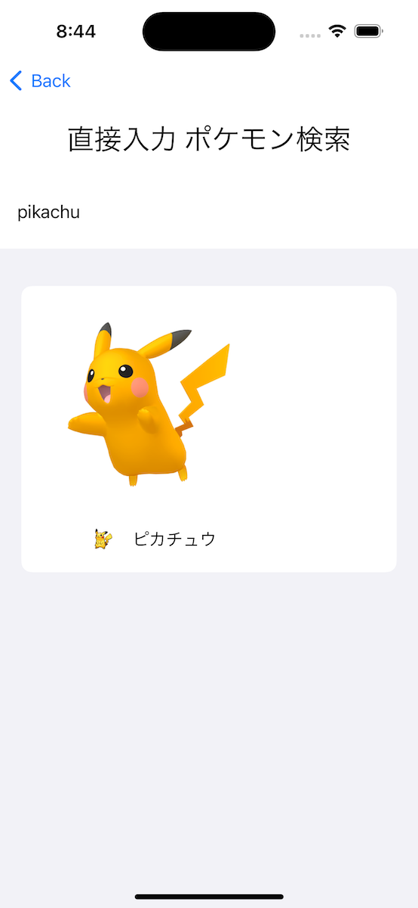

# ポケモン検索アプリ

これは pokeapi WebAPIを使用して作成されたポケモン検索アプリで、ミニゲームも付属しています。

### メーイン画面

これはポケモン検索アプリのメイン画面ます。

### 画像2：ポケモン詳細ページ

キーワードを入力してポケモン情報を検索、詳細情報を確認できます。

### 画像3：ポケモンゲーム

アプリには楽しいポケモンゲームも付属しており、ユーザーのインタラクティブ体験を高めます。

## アプリ概要

このアプリは pokeapi WebAPIを使用して、ポケモン情報の検索機能を実現し、小さなゲームも提供しています。ぜひこの楽しいポケモン検索アプリをお試しください！

